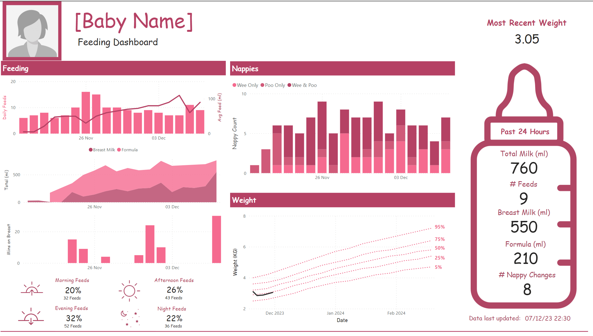
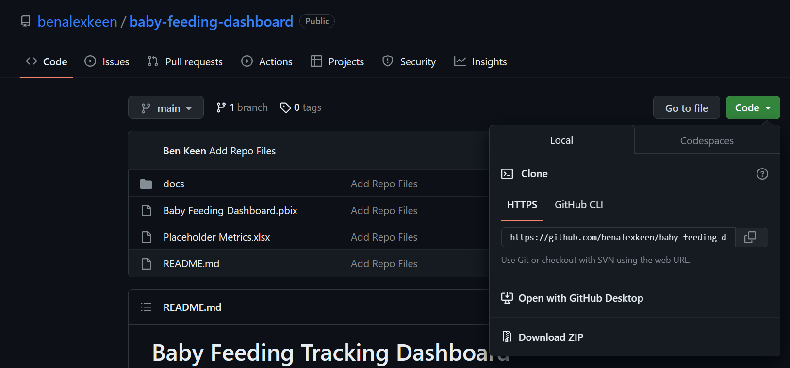
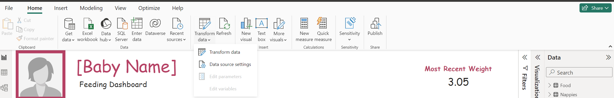
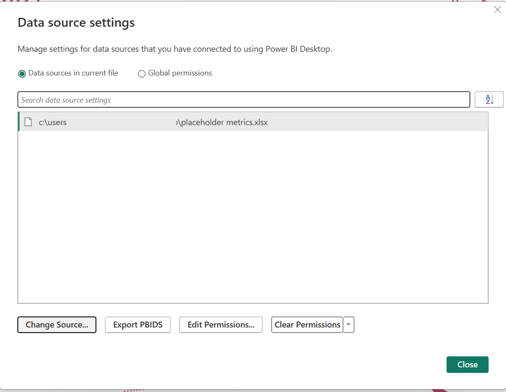
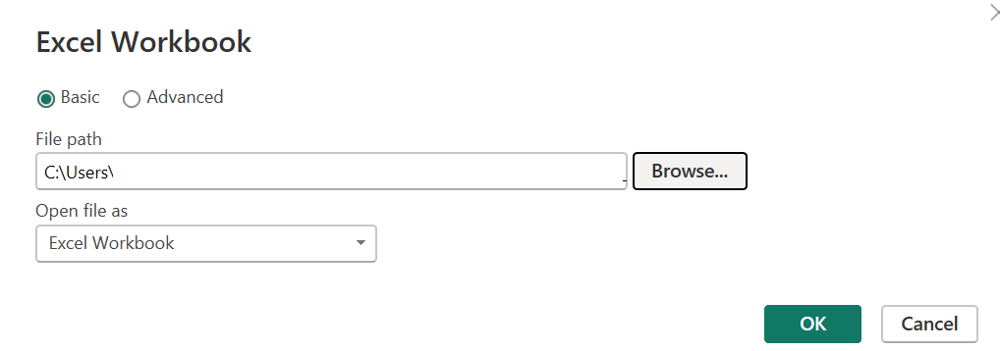

# Baby Feeding Tracking Dashboard

This repository includes a dashboard for tracking the feeding, nappies and weight of a baby. It includes some anonymised sample data.

It is a super "quick and dirty" dashboard I created during my paternity leave to track our baby's feeds and I make no promises with regards to bugs and/or changes.

# Instructions for use

First download this repository to your computer by downloading the repo as a zip by clicking on "Code" -> "Download Zip" on this page.

Unzip the file on your own computer. There are two main files:
- "Placeholder Metrics.xlsx"
  - This is the Excel Spreadsheet that the dashboard reads data from
- "Baby Feeding Dashboard.pbix"
  - This is the actual Power BI dashboard

## Data

The data is stored in "Placeholder Metrics.xlsx" and will need to be updated to suit your own baby's data. 

There are three sheets that need updating and the data dictionary for these are as follows:

### Food

| Column                  | Description                                                         |
|-------------------------|---------------------------------------------------------------------|
| Date                    | Date of the feed in DD/MM/YYYY format                               |
| Time                    | Time of the feed in hh:mm:ss format                                 |
| Expressed Breastmilk ml | The volume of expressed breastmilk in the given feed in ml          |
| Formula ml              | The volume of formula in the given feed in ml                       |
| Breastfeed mins         | The number of minutes of breastfeeding in the given feed in minutes |
| Colostrum feed          | 1 if colostrum was fed, 0 or blank otherwise                        |
| Notes                   | Any notes on the given feed                                         |

**Assumptions:** Note that I have made a super-simplified assumption that 1 colostrum feed is 5ml and that 1 minute of breastfeeding is 5ml.

### Nappies

| Column        | Description                                   |
|---------------|-----------------------------------------------|
| Date          | Date of the nappy change in DD/MM/YYYY format |
| Time          | Time of the nappy change in hh:mm:ss format   |
| Poo           | Yes/No boolean value                          |
| Poo Intensity | Subjective measurement of size of poo         |
| Wee           | Yes/No boolean value                          |
| Wee Intensity | Subjective measurement of size of wee         |
| Notes         | Any notes on the given nappy change           |

### Weight

| Column | Description                              |
|--------|------------------------------------------|
| Date   | Date of the weight measurement           |
| P5     | 5th Percentile of weight for given date  |
| P25    | 25th Percentile of weight for given date |
| P50    | 50th Percentile of weight for given date |
| P75    | 75th Percentile of weight for given date |
| P95    | 95th Percentile of weight for given date |
| Baby   | Baby's weight on the given date          |

Note that the baby's weights are for a girl born on 20/11/2023, the dates will need to be changed to suit your birth date and to get the weights for a baby boy [you can get them from the World Health Organisation here](https://www.who.int/tools/child-growth-standards/standards/weight-for-age).

## Power BI Dashboard

The Power BI Dashboard is in "Baby Feeding Dashboard.pbix"

If you are unfamiliar with Power BI, there is some free training available from Microsoft:
- [Model data with Power BI](https://learn.microsoft.com/en-us/training/paths/model-data-power-bi/)
- [Build Power BI visuals and reports](https://learn.microsoft.com/en-us/training/paths/build-power-bi-visuals-reports/)

Instructions for use are as follows:
- [Download & Install Power BI Desktop for Free](https://powerbi.microsoft.com/en-us/downloads/) on a Windows computer
- Open "Baby Feeding Dashboard.pbix"
- In the header ribbon, click on the "Transform Data" dropdown menu and select "Data source settings"

- In the dialogue box that opens, select the Excel workbook and click on "Change Source..."

- In the next dialogue box that opens, select "Browse..." and navigate to where your updated Excel spreadsheet is found

- Then press "OK" and then "Close" on the respective dialogue boxes
- Click "Refresh" on the header ribbon

Feel free to update visuals and colours based on your own tastes
